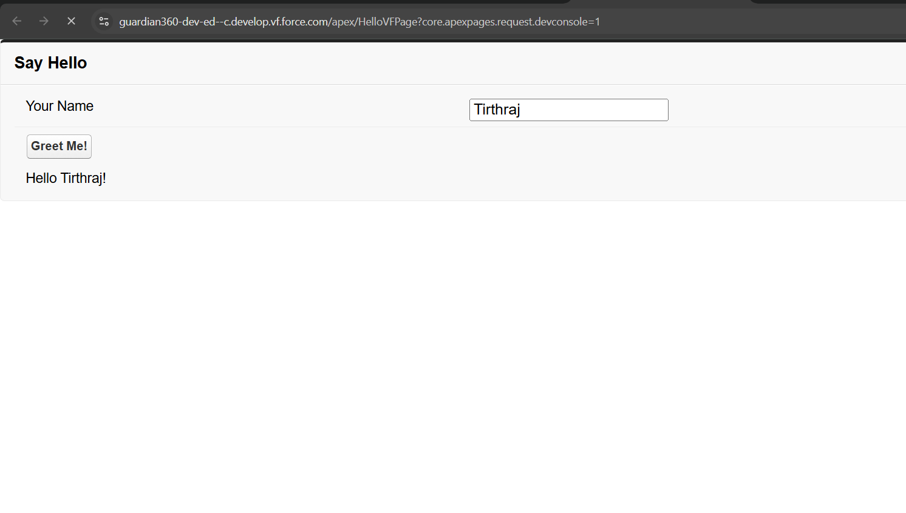

# How to connect VF Pages to Apex Classes

Following is a simple greetings example.

1. Step 1: Create a new Apex Class called `HelloController.apxc`

```java
public class HelloController {
    public String name {get; set;}
    public String greeting {get; set;}
    
    public void sayHello(){
        greeting = 'Hello ' + name + '!';
    }
}
```
You can test the above code by pressing `Ctrl + E` and enter  

```java
HelloController obj = new HelloController();
obj.name = 'Tirthraj';
obj.sayHello();
System.debug(obj.greeting);
```

In the debug logs, you should see `Hello Tirthraj!`

---

Step 2: Create a new VisualForce Page called `HelloVFPage.vfp` and add the following code

```html
<!-- Define the controller aka Apex Class -->
<apex:page controller="HelloController">
    <apex:form>
    	
        <apex:pageBlock title="Say Hello">
            
            <!-- Similar to div in html -->
            <apex:pageBlockSection>
                
                <apex:outputLabel value="Your Name" />
                <!-- This input takes the user input and stores it in name variable in the HelloController class. (It works because the name setter is public) -->
                <apex:inputText value="{!name}" />
                
                <!-- This is an input button that performs the sayHello() function and later rerenders the div with id = output -->
                <apex:commandButton value="Greet Me!" action="{!sayHello}" rerender="output"/>
             
            </apex:pageBlockSection>
         
            <!-- This section gets rerendered when user clicks on the command button -->
            <apex:pageBlockSection id="output">
                <apex:outputText value="{!greeting}" />
            </apex:pageBlockSection>
        
        </apex:pageBlock>
        
    </apex:form>
</apex:page>
```


Output:

