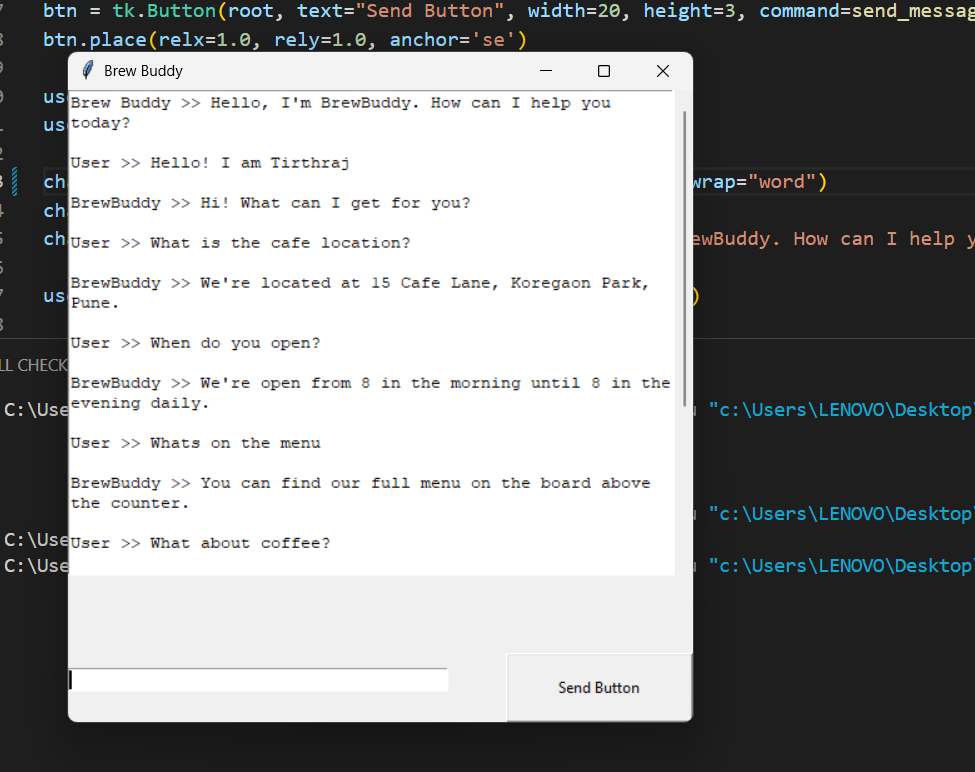
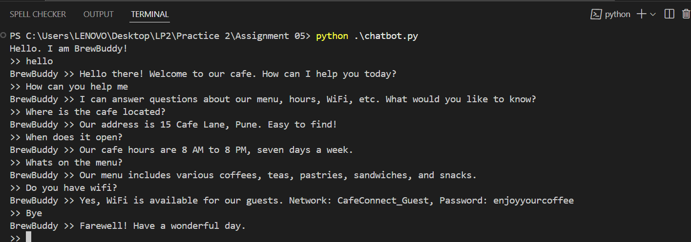

### How to run

### With UI
```bash
python ui.py
```

### Without UI
```bash
python chatbot.py
```

### How to customize the chatbot?  
Just change the rules in `rules.py` and you'll be good to go!

### Output Screenshots

#### With UI


#### Without UI
