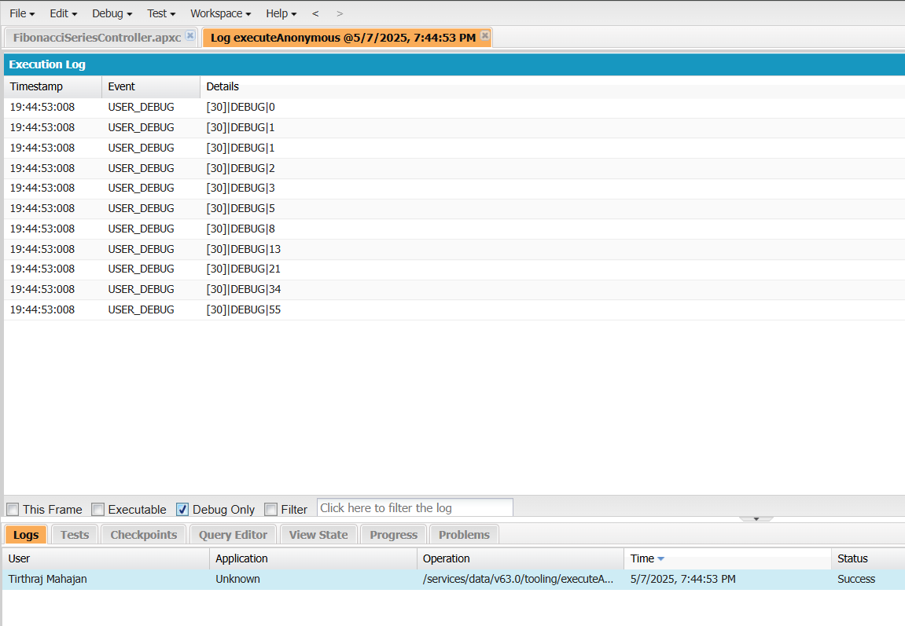

# Fibonacci Series

Write the code for Fibonacci Series using Apex Programming Language

### How to run  

Press `Ctrl + E` and enter the following code in Anonymous Window

```java
FibonacciSeriesController obj = new FibonacciSeriesController();
// Enter the number of fibonacci numbers
obj.targetCount = 10;
obj.solve();
obj.printSeries();
```

### Output

