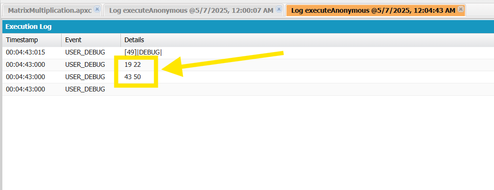
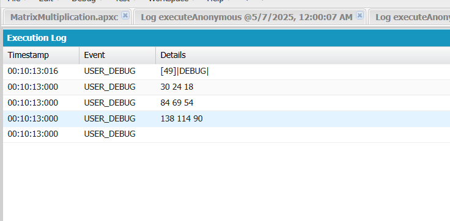
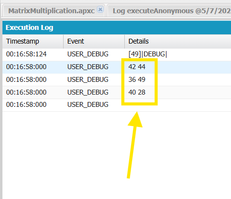

## Matrix Multiplication


### How to run

1. Cltr + E and Type the following

```java
List<List<Integer>> matrixA = new List<List<Integer>>();
matrixA.add(new List<Integer>{1,2});
matrixA.add(new List<Integer>{3,4});

List<List<Integer>> matrixB = new List<List<Integer>>();
matrixB.add(new List<Integer>{5,6});
matrixB.add(new List<Integer>{7,8});


MatrixMultiplication obj = new MatrixMultiplication(matrixA, matrixB);
obj.mulitply();
obj.printSolution();
```

2. Check `Open Logs` and Click on `Execute`

3. Check `Debug Only`

### Output




Which is correct as
```
[ 1, 2 ]    x  [ 5, 6 ]   =   [ 19, 22 ]
[ 3, 4 ]       [ 7, 8 ]       [ 43, 50 ]
```

---

### 3x3 Example

```java
List<List<Integer>> matrixA = new List<List<Integer>>();
matrixA.add(new List<Integer>{1,2,3});
matrixA.add(new List<Integer>{4,5,6});
matrixA.add(new List<Integer>{7,8,9});

List<List<Integer>> matrixB = new List<List<Integer>>();
matrixB.add(new List<Integer>{9,8,7});
matrixB.add(new List<Integer>{6,5,4});
matrixB.add(new List<Integer>{3,2,1});


MatrixMultiplication obj = new MatrixMultiplication(matrixA, matrixB);
obj.mulitply();
obj.printSolution();
```

### Output


---

### Example (3x3) * (3x2)

```java
List<List<Integer>> matrixA = new List<List<Integer>>();
matrixA.add(new List<Integer>{9,5,2});
matrixA.add(new List<Integer>{1,8,5});
matrixA.add(new List<Integer>{3,1,6});

List<List<Integer>> matrixB = new List<List<Integer>>();
matrixB.add(new List<Integer>{3,2});
matrixB.add(new List<Integer>{1,4});
matrixB.add(new List<Integer>{5,3});


MatrixMultiplication obj = new MatrixMultiplication(matrixA, matrixB);
obj.mulitply();
obj.printSolution();
```

### Output

