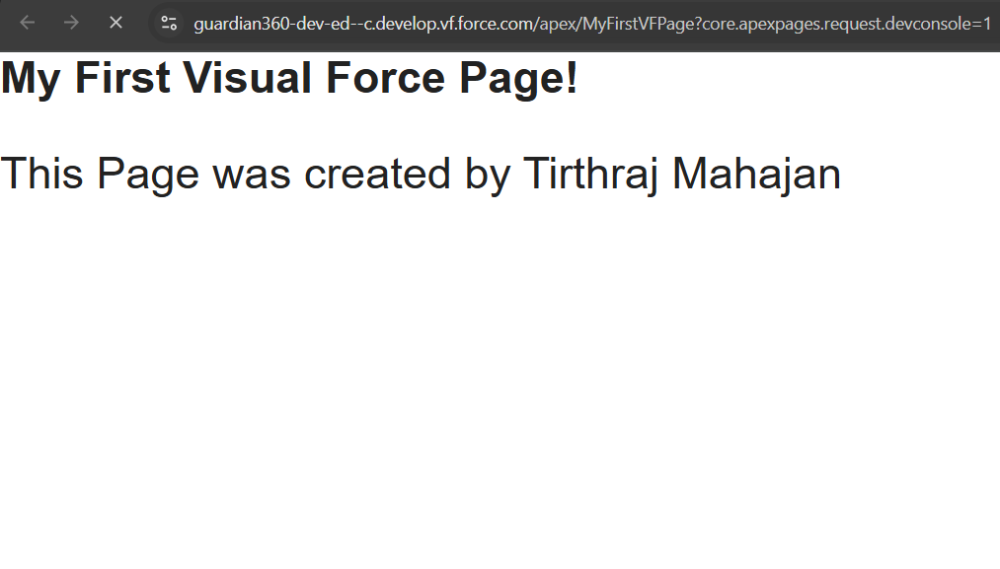

## How to Create a VisualForce Page

Go to Developers Console -> `File` -> `New` -> `VisualForce Page`
  
Then create a new Page called `MyFirstVFPage.vfp`

Then inside of the page, enter the following

```html
<apex:page >
    <h1>
        My First Visual Force Page!
    </h1>
    <p>
        This Page was created by Tirthraj Mahajan
    </p>
</apex:page>
```

Then click on `Preview` (Top Left Corner below the file name)

