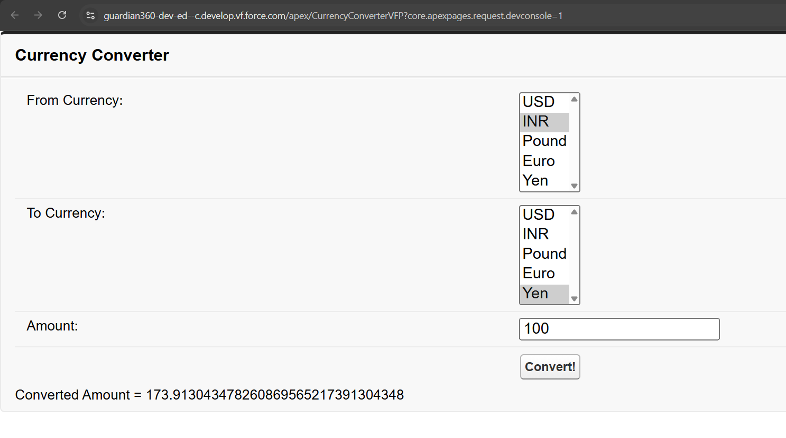

## Assignment 1 : Currency Converter

Step 1: Go to Developer's Console

Step 2: Click on `File` -> `New` -> `Apex Class` and create a new Apex Class called `CurrencyConverter.apxc`

Step 3: Paste the code inside `CurrencyController.apxc` and save the program

Step 4: Click on `File` -> `New` -> `VisualForce Page` and create a new VisualForce Page called `CurrencyConverterVFP.vfp`

Step 5: Paste the code in the `CurrencyConverterVFP.vfp` and save the code

Step 6: Click `Preview` and test the program

